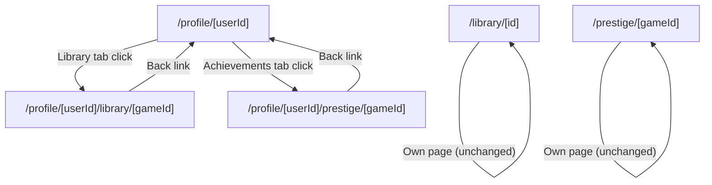
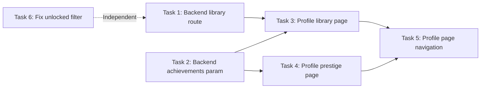

# Implementation Plan: Profile Sub-Pages for Library & Prestige

## Objective

Create public-facing game detail pages accessible from another user's profile, add navigation links from profile page, fix library detail page to only show unlocked achievements.

---

## Architecture Overview



---

## Task Breakdown

### Task 1: Backend — New API Endpoint for Another User's Game Detail

**File**: [library.js](file:///c:/Users/tayya/Desktop/GitHub/Plasma_Full-Stack_App/server/routes/library.js)

**Problem**: Existing `GET /api/library/:gameId` (line 148) only fetches games for `req.userId` (authenticated user). Profile sub-pages need game data for **another** user.

**Solution**: Add new route `GET /api/library/user/:userId/:gameId`

```diff
+// GET /api/library/user/:userId/:gameId
+// Get a specific game from another user's library
+router.get('/user/:userId/:gameId', authenticateToken, async (req, res) => {
+    const { userId, gameId } = req.params;
+    try {
+        const result = await pool.query(`
+            SELECT le."appID", le."hoursPlayed", le."isCurrentlyPlaying", le."lastPlayedAt",
+                   g."title", g."platform", g."coverArtURL"
+            FROM "library_entries" le
+            JOIN "games" g ON le."appID" = g."appID"
+            WHERE le."userID" = $1 AND le."appID" = $2
+        `, [userId, gameId]);
+        if (result.rows.length === 0) {
+            return res.status(404).json({ success: false, message: 'Game not found in library' });
+        }
+        res.json({ success: true, data: result.rows[0] });
+    } catch (error) {
+        console.error('Error fetching user game details:', error);
+        res.status(500).json({ success: false, message: 'Internal server error' });
+    }
+});
```

> [!IMPORTANT]
> Route must be placed **before** the existing `/:gameId` catch-all route (line 148) to avoid route conflicts with Express. Insert after the IGDB routes around line 65.

---

### Task 2: Backend — Achievement Endpoint Supporting `userId` Query Param

**File**: [achievements.js](file:///c:/Users/tayya/Desktop/GitHub/Plasma_Full-Stack_App/server/routes/achievements.js)

**Problem**: `GET /api/achievements/game/:appID` (line 156) only returns achievements for `req.userId`. Profile pages need achievement data for a **target** user.

**Solution**: Add optional `?userId=` query param support to existing endpoint.

```diff
 router.get('/game/:appID', authenticateToken, async (req, res) => {
     const { appID } = req.params;
-    const userId = req.userId;
+    const userId = req.query.userId || req.userId;
```

This single-line change makes the endpoint dual-purpose while maintaining backward compatibility.

---

### Task 3: Frontend — Profile Library Game Detail Page

**Path**: `client/app/profile/[userId]/library/[gameId]/page.js`

**Approach**: Read-only adaptation of [library/[id]/page.js](file:///c:/Users/tayya/Desktop/GitHub/Plasma_Full-Stack_App/client/app/library/%5Bid%5D/page.js).

**Key differences from original page**:

| Feature | Original `/library/[id]` | Profile `/profile/[userId]/library/[gameId]` |
|---|---|---|
| Data source | `GET /api/library/:gameId` (own) | `GET /api/library/user/:userId/:gameId` |
| Achievements | `GET /api/achievements/game/:id` (all) | `GET /api/achievements/game/:id?userId=X` (unlocked only) |
| "Set Playing" button | ✅ Shown | ❌ Hidden |
| "Remove" button | ✅ Shown | ❌ Hidden |
| "Add Milestone" button | ✅ Shown | ❌ Hidden |
| "Add to Collection" button | ✅ Shown | ❌ Hidden |
| Back link target | `/library` | `/profile/[userId]` |
| WebSocket heartbeat | ✅ Active | ❌ Not needed |
| IGDB fallback fetch | ✅ Enabled | ❌ Not needed (user must own game) |

**Implementation notes**:
- Extract `params` as `{ userId, gameId }`
- Fetch game via `GET /api/library/user/${userId}/${gameId}`
- Fetch achievements via `GET /api/achievements/game/${gameId}?userId=${userId}`
- Filter achievements client-side: `.filter(a => a.isUnlocked)` to show only unlocked
- Render hero banner, stats grid, achievement badges — all read-only
- Hide all interactive controls (play toggle, remove, add milestone)

---

### Task 4: Frontend — Profile Prestige Game Detail Page

**Path**: `client/app/profile/[userId]/prestige/[gameId]/page.js`

**Approach**: Read-only adaptation of [prestige/[gameId]/page.js](file:///c:/Users/tayya/Desktop/GitHub/Plasma_Full-Stack_App/client/app/prestige/%5BgameId%5D/page.js).

**Key differences from original page**:

| Feature | Original `/prestige/[gameId]` | Profile `/profile/[userId]/prestige/[gameId]` |
|---|---|---|
| Data source | `GET /api/achievements/game/:appID` (own) | `GET /api/achievements/game/:appID?userId=X` |
| Friends tab | ✅ Shown | ❌ Hidden (not relevant on profile view) |
| Back link target | `/prestige` | `/profile/[userId]` |

**Implementation notes**:
- Extract `params` as `{ userId, gameId }`
- Fetch data via `GET /api/achievements/game/${gameId}?userId=${userId}`
- Keep `AchievementCard` and `FriendAchievementCard` components (can import or inline)
- Remove "Friends" tab or hide it
- Back link → `/profile/${userId}`

---

### Task 5: Frontend — Add Navigation from Profile Page

**File**: [profile/[userId]/page.js](file:///c:/Users/tayya/Desktop/GitHub/Plasma_Full-Stack_App/client/app/profile/%5BuserId%5D/page.js)

#### 5a. Library Tab — Make Game Cards Clickable

Current code (line 369): Game cards render but have no navigation to detail pages.

```diff
-  <div key={game.id} className="relative aspect-[3/4] rounded-xl overflow-hidden group cursor-pointer hover:scale-[1.03] transition-transform">
+  <Link href={`/profile/${targetUserId}/library/${game.id}`} key={game.id} className="relative aspect-[3/4] rounded-xl overflow-hidden group cursor-pointer hover:scale-[1.03] transition-transform">
     ...
-  </div>
+  </Link>
```

#### 5b. Achievements Tab — Make Game Titles Clickable

Current code (line 411): Game titles in achievement groups are plain text.

```diff
-  <h3 className="text-[11px] font-bold ...">{game.title}</h3>
+  <Link href={`/profile/${targetUserId}/prestige/${game.appID}`} className="text-[11px] font-bold ... hover:text-plasma-primary transition-colors">
+    {game.title}
+  </Link>
```

> [!NOTE]
> Achievement groups need `appID` stored in the data model. Currently only `title` is mapped at line 151. Need to also map `appID` from the API response.

---

### Task 6: Fix — Library Detail Page Unlocked-Only Achievements

**File**: [library/[id]/page.js](file:///c:/Users/tayya/Desktop/GitHub/Plasma_Full-Stack_App/client/app/library/%5Bid%5D/page.js)

**Problem**: `fetchAchievements` (line 43) calls `GET /api/achievements/game/${id}` which returns **all** achievements (locked + unlocked). The page renders locked ones as grayed out, but user only wants unlocked shown.

**Solution**: Filter response client-side:

```diff
  if (achievementJson.success) {
-   setAchievements(achievementJson.data.achievements.map(ach => {
+   setAchievements(achievementJson.data.achievements.filter(ach => !!ach.unlockedAt).map(ach => {
```

This adds `.filter(ach => !!ach.unlockedAt)` before `.map()` to strip locked achievements. Keeps backend API unchanged (prestige page still needs locked achievements).

Also remove the lock icon rendering logic (line 403-406) and grayed-out styles since all rendered achievements are now unlocked:

```diff
-  <div ... className={`... ${!ach.unlocked ? 'opacity-40 grayscale' : ''}`}>
+  <div ... className="...">
```

---

## Execution Order



| Step | Task | File(s) | Estimated LOC |
|------|------|---------|---------------|
| 1 | Backend library route | `server/routes/library.js` | ~20 |
| 2 | Backend achievements param | `server/routes/achievements.js` | ~1 |
| 3 | Profile library page | `client/app/profile/[userId]/library/[gameId]/page.js` | ~280 |
| 4 | Profile prestige page | `client/app/profile/[userId]/prestige/[gameId]/page.js` | ~240 |
| 5 | Profile page navigation | `client/app/profile/[userId]/page.js` | ~15 |
| 6 | Fix unlocked filter | `client/app/library/[id]/page.js` | ~5 |

---

## Risk & Considerations

> [!WARNING]
> **Route ordering in Express**: `GET /api/library/user/:userId/:gameId` must be registered **before** `GET /api/library/:gameId` — otherwise Express will interpret `user` as a `gameId` parameter.

> [!NOTE]
> **Privacy**: Achievement endpoint currently accepts any `userId` query param without privacy checks. If profile visibility restrictions apply, middleware should validate access. Acceptable as-is for now since profile pages already follow visibility rules upstream.

> [!TIP]
> **Code reuse**: Achievement card components (`AchievementCard`, `FriendAchievementCard`) from prestige page can be extracted to `components/ui/` for sharing. However, for this iteration inline duplication keeps pages self-contained and avoids refactoring risk.
